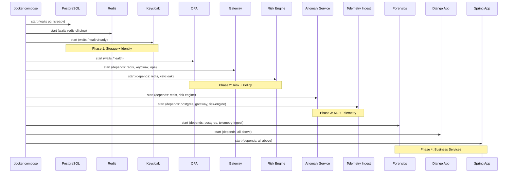
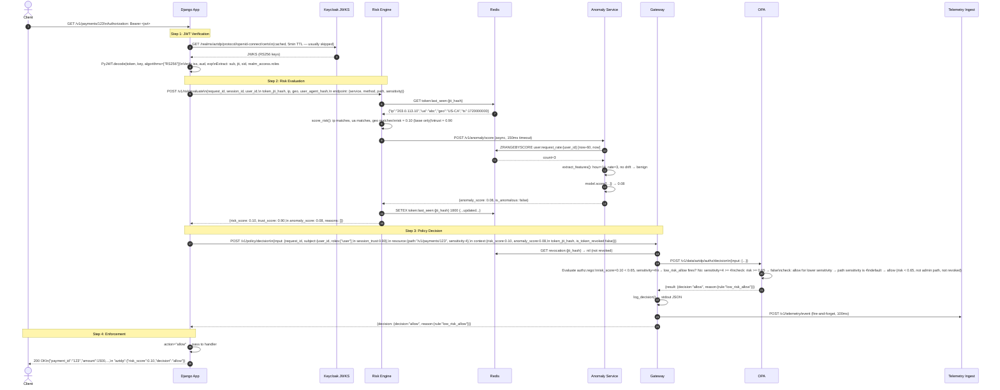
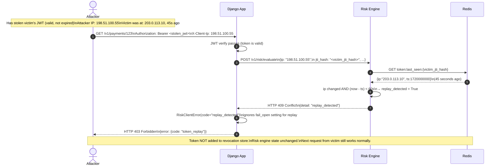
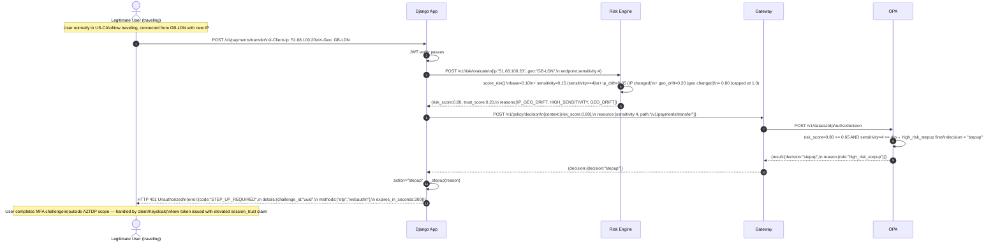
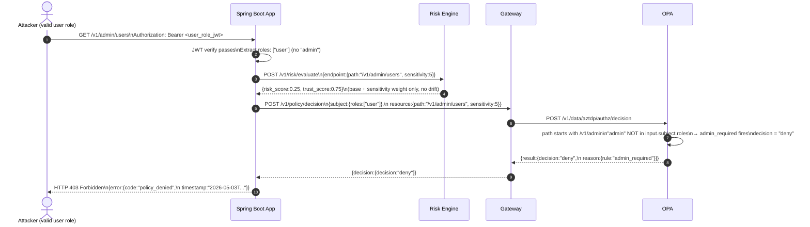
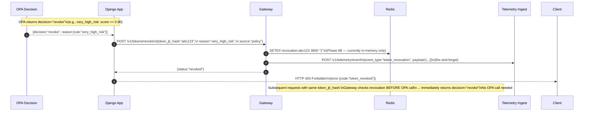
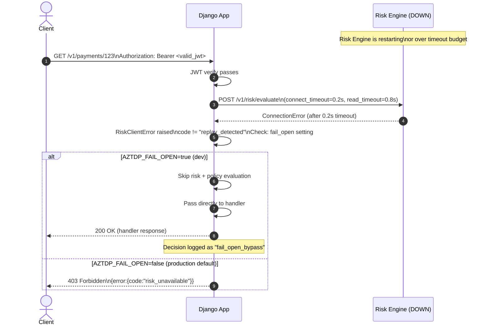
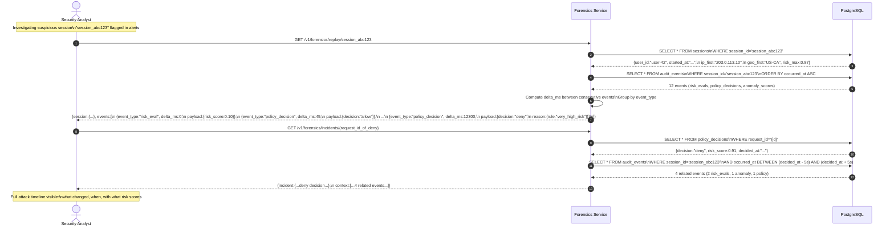

# AZTDP Sequence Diagrams

## SD-1: Service Startup and Dependency Order

---

## SD-2: Normal Authorized Request (Full Stack)

---

## SD-3: Token Replay Attack — Blocked (Hard Deny)

---

## SD-4: High-Risk Request — Step-Up Authentication Required

---

## SD-5: Privilege Escalation Attempt — Blocked

---

## SD-6: Token Revocation Flow

---

## SD-7: Fail-Open Scenario (Risk Engine Unavailable)

---

## SD-8: Forensics — Incident Reconstruction

