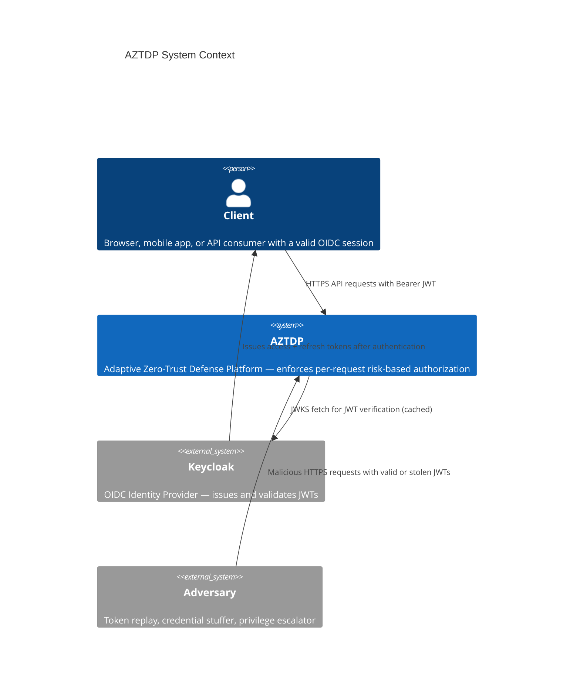
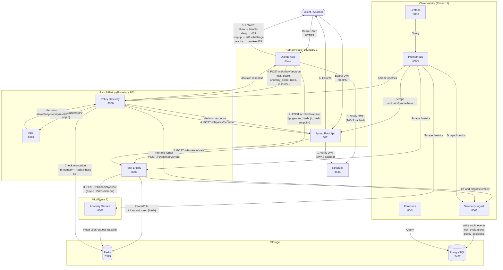
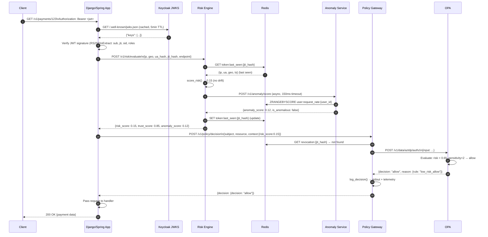
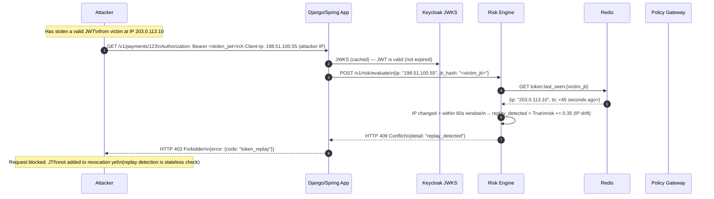
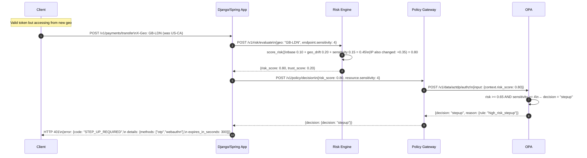

# AZTDP Data Flow Diagrams

## DFD Level 0 — System Context



---

## DFD Level 1 — AZTDP Internal Data Flows



---

## Request Lifecycle — Normal (Authorized) Request



---

## Request Lifecycle — Token Replay Attack (Blocked)



---

## Request Lifecycle — High Risk / Step-Up Required



---

## Trust Boundary Map

```
═══════════════════════════════════════════════════════════════════
  EXTERNAL ZONE (untrusted)
  ┌─────────────────────────────────────┐
  │  Client Browser / API Consumer      │
  │  Adversary (same attack surface)    │
  └─────────────────────────────────────┘
                    │
                    │ HTTPS (TLS)
                    │
═══════════════ BOUNDARY 1 ════════════════════════════════════════
  APP ZONE (partially trusted — JWT-verified identity only)
  ┌─────────────────────────────────────┐
  │  Django App :8010                   │
  │  Spring Boot App :8011              │
  └─────────────────────────────────────┘
         │                   │
         │ HTTP (internal)    │ HTTP (internal)
         │                   │
═══════════════ BOUNDARY 2 ══════════╦═══ BOUNDARY 3 ═════════════
  RISK ZONE                          ║  POLICY ZONE
  ┌──────────────────────┐           ║  ┌──────────────────────┐
  │  Risk Engine :8001   │           ║  │  Policy Gateway :8000 │
  │  Anomaly Svc :8002   │           ║  │  OPA :8181            │
  └──────────────────────┘           ║  └──────────────────────┘
         │                           ║
         │ Redis protocol            ║
         ▼                           ║
  ┌──────────────────────┐           ║
  │  Redis :6379         │           ║
  │  (session state)     │ ──────────╝ (revocation check)
  └──────────────────────┘
═══════════════ BOUNDARY 4 ════════════════════════════════════════
  IDENTITY ZONE (trusted, external)
  ┌─────────────────────────────────────┐
  │  Keycloak :8080                     │
  │  JWKS endpoint (RS256 keys)         │
  └─────────────────────────────────────┘
═══════════════════════════════════════════════════════════════════
  PERSISTENCE ZONE
  ┌─────────────────────────────────────┐
  │  PostgreSQL :5432                   │
  │  (audit_events, risk_evaluations,   │
  │   policy_decisions, sessions)       │
  └─────────────────────────────────────┘
```
